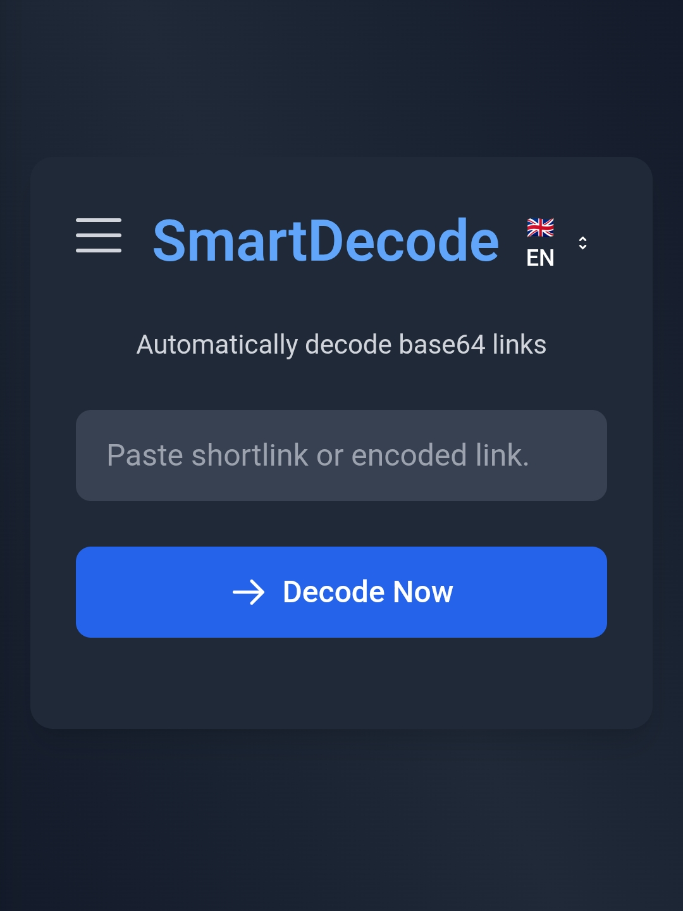

# SmartDecode Web

## Overview
SmartDecode Web adalah alat praktis untuk mendekode link yang dienkripsi (base64, URL-encoded, hex) secara otomatis. Dibuat khusus untuk membantu pengunduhan komik dan novel dari berbagai situs yang sering menggunakan teknik enkripsi link dan banyak iklan. Dengan alat ini, Anda bisa mendapatkan link asli dengan mudah dan cepat tanpa gangguan iklan yang mengganggu.

## Fitur Utama
✅ **Dekode Otomatis** - Mendeteksi dan mendekode base64, URL-encoding, dan hex secara otomatis  
🌐 **Multi Bahasa** - Tersedia dalam Bahasa Indonesia dan Inggris  
📚 **Riwayat Dekode** - Menyimpan hingga 10 hasil dekode terakhir  
📱 **Responsif** - Bekerja optimal di desktop maupun mobile  
⚡ **Cepat & Ringan** - Proses decoding instan tanpa loading lama  

## Cara Menggunakan
1. Tempelkan link yang ingin didekode
2. Klik tombol "Dekode Sekarang"
3. Hasil dekode akan muncul dengan:
   - Link asli yang bisa langsung dibuka/disalin
   - Sumber link (Google Drive, Mediafire, dll)
   - Tombol aksi untuk membuka/menyalin link

## Untuk Pengguna Komik/Novel
Alat ini sangat berguna untuk:
- Mendapatkan tautan unduhan asli
- Melewati halaman redirect dan iklan yang mengganggu
- Mengakses konten langsung dari penyimpanan cloud (Google Drive, Mediafire, dll)
- Memecahkan kode link yang sengaja dipersulit oleh situs

---

# SmartDecode Web

## Overview
SmartDecode Web is a practical tool for automatically decoding encrypted links (base64, URL-encoded, hex). Specially designed to help download comics and novels from various sites that frequently use link encryption techniques and excessive ads. With this tool, you can get the original link easily and quickly without annoying ad interruptions.

## Key Features
✅ **Auto Decoding** - Detects and decodes base64, URL-encoding, and hex automatically  
🌐 **Multi Language** - Available in Indonesian and English  
📚 **Decode History** - Saves up to 10 recent decode results  
📱 **Responsive** - Works optimally on both desktop and mobile  
⚡ **Fast & Lightweight** - Instant decoding process without long loading  

## How to Use
1. Paste the link you want to decode
2. Click the "Decode Now" button
3. Decoded results will appear with:
   - Original link that can be opened/copied directly
   - Link source (Google Drive, Mediafire, etc)
   - Action buttons to open/copy the link

## For Comic/Novel Users
This tool is extremely useful for:
- Getting original download links
- Bypassing redirect pages and intrusive ads
- Accessing content directly from cloud storage (Google Drive, Mediafire, etc)
- Decrypting intentionally obfuscated links from websites

## Screenshot

## Teknologi
- HTML5
- CSS3 (Tailwind CSS)
- JavaScript Modern
